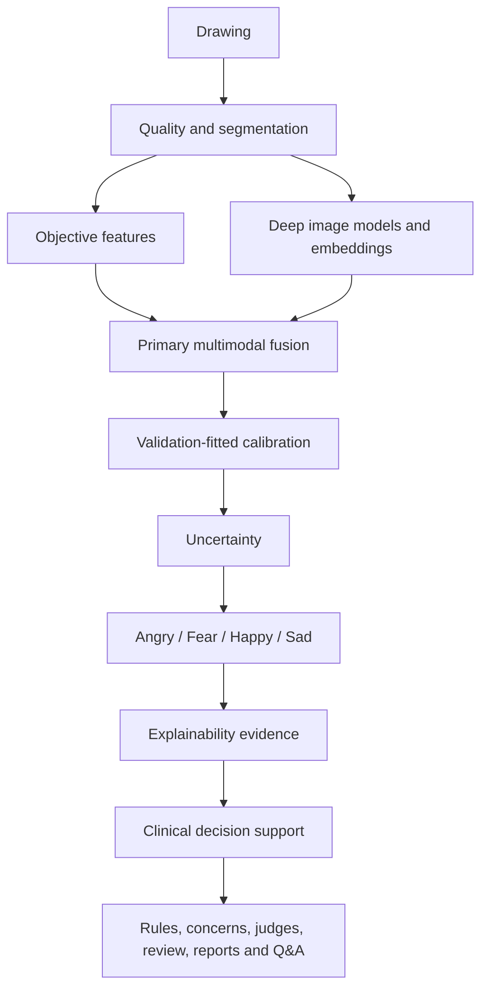

# Thesis architecture

Psychologist rules and concern profiles never feed the primary classifier.
Semantic fusion must remain a separately named supplementary experiment.

The primary thesis contribution is the validation-selected fusion of objective
drawing features and deep visual representations with calibration, uncertainty,
and evidence traceability. Clinical decision support is downstream and cannot
modify classifier probabilities.
